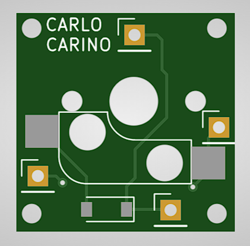
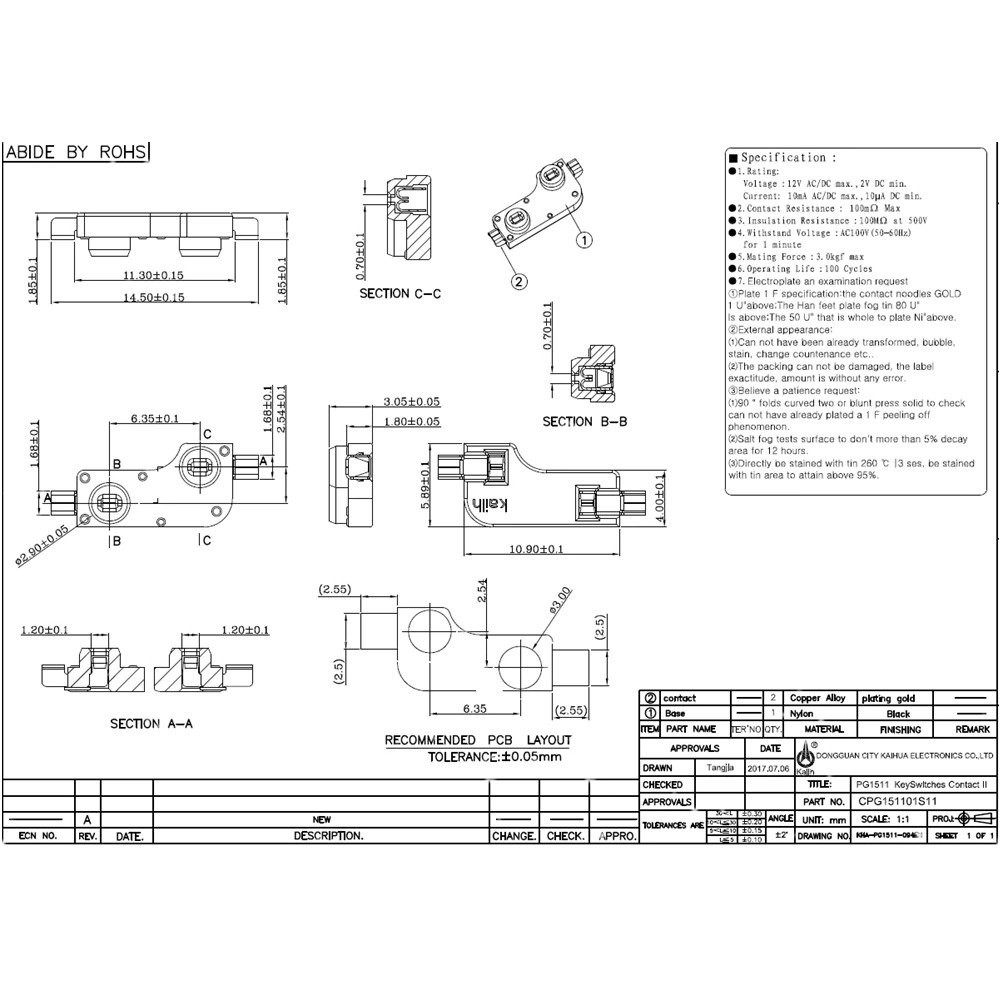
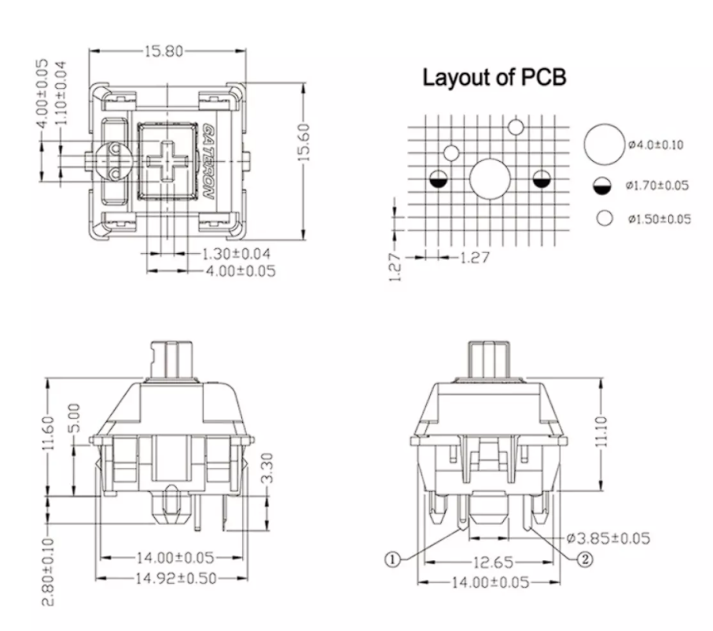
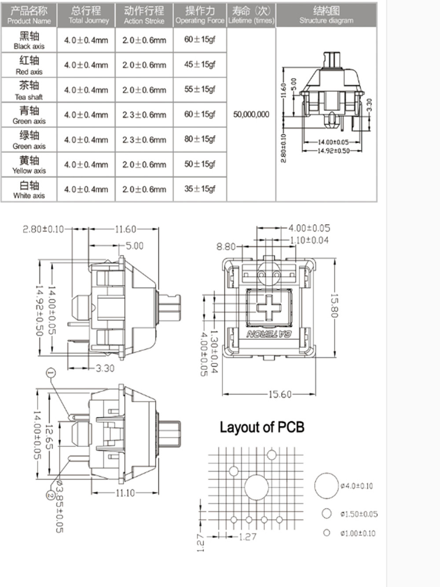
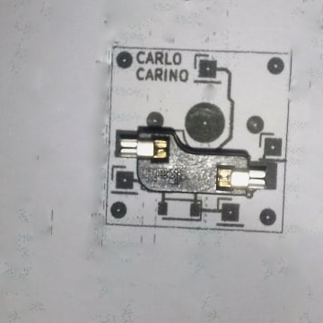

# Single_Switch_Hotswap_PCB_Module

A simple single switch pcb for mechanical keyboard prototyping row and column matrices.
PCB features a hot swappable socket and uses a 1n4148 SMD diode.

13 Feb 2022 - did the initial BOM. Created kicad project. Finished with hotswap socket symbol and footprint. To start on schematic.

14 Feb 2022 - finished schematic and pcb. Generated gerber file. Test print and check compatibility with hotswap socket and 3/5 pin switch.

15 Feb 2022 - check if pcb within 1u keycap size(18x18mm). Need to make pcb smaller. Switch spacing. center to center is 19.05mm.

16 Feb 2022 - test print. all components line up. Move on to creating a matrix of single switch pcb. New kicad project?

18 Feb 2022 - created kicad project for single switch matrix

## To Do
- Initial BOM (done 13 Feb 2022)
- Symbol and footprint for each component (done 14 Feb 2022)
- Schematics (done 14 Feb 2022)
- Board outline (done 14 Feb 2022)
- Board routing (done 14 Feb 2022)
- Test parts (done 16 Feb 2022)
- Create a PCB with matrix of single switch for manufacturing. (started 18 Feb 2022)

## Initial BOM
- hotswap socket (need to create library)
- 1n4148 SMD diode
- 4 pin headers (2 for column, 2 for row)
- 4 mounting holes (M3?)

## Mechanical Drawing

## Test Print

